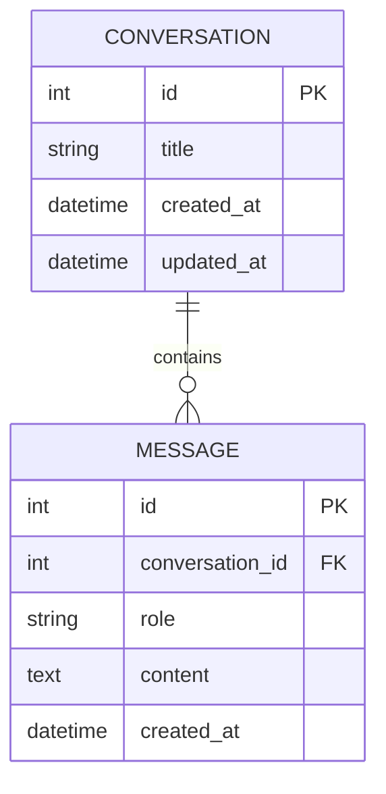

# 数据库概念设计文档

## 1. E-R图



## 2. 表结构设计

### 2.1 对话表 (conversations)

| 字段名 | 类型 | 约束 | 描述 |
|--------|------|------|------|
| id | INTEGER | PRIMARY KEY AUTOINCREMENT | 对话ID |
| title | VARCHAR(255) | NOT NULL | 对话标题 |
| created_at | DATETIME | NOT NULL DEFAULT CURRENT_TIMESTAMP | 创建时间 |
| updated_at | DATETIME | NOT NULL DEFAULT CURRENT_TIMESTAMP | 更新时间 |

### 2.2 消息表 (messages)

| 字段名 | 类型 | 约束 | 描述 |
|--------|------|------|------|
| id | INTEGER | PRIMARY KEY AUTOINCREMENT | 消息ID |
| conversation_id | INTEGER | NOT NULL, FOREIGN KEY | 所属对话ID |
| role | VARCHAR(50) | NOT NULL | 消息角色 (user/assistant) |
| content | TEXT | NOT NULL | 消息内容 |
| created_at | DATETIME | NOT NULL DEFAULT CURRENT_TIMESTAMP | 创建时间 |

## 3. 表关系说明

### 3.1 一对多关系
- 一个对话(CONVERSATION)可以包含多条消息(MESSAGE)
- 通过[conversation_id]字段建立外键关系

## 4. 索引设计

### 4.1 对话表索引
- 主键索引：id
- 时间索引：created_at (用于按时间排序查询)

### 4.2 消息表索引
- 主键索引：id
- 外键索引：conversation_id (用于快速查找同一对话的所有消息)
- 时间索引：created_at (用于按时间排序查询)

## 5. 数据示例

### 5.1 对话表示例
| id | title | created_at | updated_at |
|----|-------|------------|------------|
| 1 | "关于人工智能的讨论" | "2023-05-01 10:00:00" | "2023-05-01 10:05:00" |
| 2 | "技术文档问答" | "2023-05-01 11:00:00" | "2023-05-01 11:00:00" |

### 5.2 消息示例
| id | conversation_id | role | content | created_at |
|----|-----------------|------|---------|------------|
| 1 | 1 | "user" | "什么是人工智能？" | "2023-05-01 10:00:00" |
| 2 | 1 | "assistant" | "人工智能是计算机科学的一个分支..." | "2023-05-01 10:00:30" |
| 3 | 1 | "user" | "它有哪些应用？" | "2023-05-01 10:02:00" |
| 4 | 1 | "assistant" | "人工智能在医疗、金融、交通等领域都有广泛应用..." | "2023-05-01 10:02:30" |
| 5 | 2 | "user" | "如何部署Node.js应用？" | "2023-05-01 11:00:00" |

## 6. SQL建表语句

```sql
CREATE TABLE conversations (
    id INTEGER PRIMARY KEY AUTOINCREMENT,
    title VARCHAR(255) NOT NULL,
    created_at DATETIME NOT NULL DEFAULT CURRENT_TIMESTAMP,
    updated_at DATETIME NOT NULL DEFAULT CURRENT_TIMESTAMP
);

CREATE TABLE messages (
    id INTEGER PRIMARY KEY AUTOINCREMENT,
    conversation_id INTEGER NOT NULL,
    role VARCHAR(50) NOT NULL,
    content TEXT NOT NULL,
    created_at DATETIME NOT NULL DEFAULT CURRENT_TIMESTAMP,
    FOREIGN KEY (conversation_id) REFERENCES conversations(id)
);

CREATE INDEX idx_messages_conversation_id ON messages(conversation_id);
CREATE INDEX idx_messages_created_at ON messages(created_at);
CREATE INDEX idx_conversations_created_at ON conversations(created_at);
```