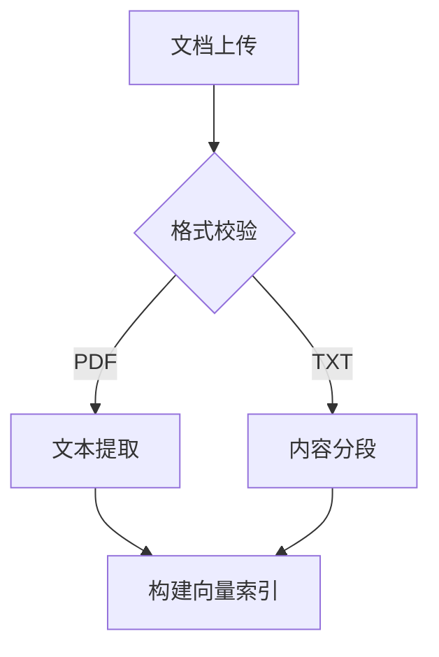
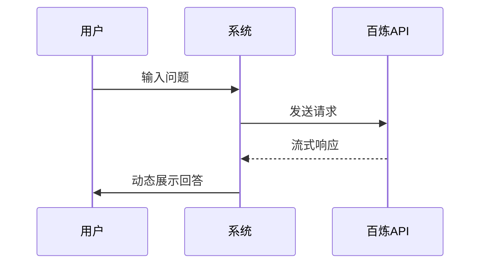

# 智能问答Web系统需求分析报告

## 1. 产品概述
本产品是一款基于阿里百炼API的智能问答Web应用，核心功能包括：
- 多轮对话交互：支持上下文关联的连续问答
- 文档智能解析：支持PDF/TXT等文档上传与内容提取
- 对话管理：包含新开对话、历史记录、结果分享功能
- 智能重试机制：提供不满意回答的重新生成功能
- 云端推理服务：集成阿里百炼API实现AI推理

目标用户群体：
- 企业知识库使用者
- 学术研究者
- 需要快速处理文档的办公人群

## 2. 用户需求分析

### 2.1 目标用户群体
| 用户类型 | 特征描述 | 需求优先级 |
|---------|----------|-----------|
| 企业用户 | 需处理内部文档知识库 | P0 |
| 学生群体 | 需文献资料快速查询 | P1 |
| 研发人员 | 需技术文档快速检索 | P1 |

### 2.2 使用场景
1. **文档问答场景**：用户上传技术文档后进行内容追问
2. **多轮咨询场景**：连续交互获取递进式答案
3. **知识沉淀场景**：通过历史记录建立个人知识库

### 2.3 核心需求
- 功能性需求：文档解析准确率>95%
- 非功能性需求：响应时间<3s（不含API耗时）

## 3. 功能需求

### 3.1 功能模块拆解

#### 3.1.1 对话交互模块
| 功能点 | 输入 | 输出 | API交互 |
|--------|------|------|---------|
| 多轮问答 | 用户问题文本 | AI回答文本 | 百炼API流式调用 |
| 上下文管理 | 对话历史记录 | 上下文标识符 | 本地存储 |

#### 3.1.2 文档处理模块

#### 3.1.3 对话管理模块
- 历史记录：SQLite本地存储（加密存储）
- 新开对话：清空当前上下文
- 结果分享：生成带token的分享链接

## 4. 关键业务流程

### 4.1 核心交互流程

### 4.2 文档处理流程
1. 用户上传文档
2. 前端校验格式
3. 后端解析内容
4. 构建倒排索引
5. 存储至向量数据库

## 5. 开发周期规划

### 5.1 开发阶段
| 阶段 | 时间 | 交付内容 |
|------|------|----------|
| MVP | 2周 | 基础问答+API集成 |
| v1.0 | 4周 | 文档处理+历史记录 |
| v1.1 | 2周 | 分享功能+重试机制 |

### 5.2 优先级排序

## 6. 非功能性需求
- 性能需求：并发量1000+ QPS
- 安全需求：HTTPS加密传输
- 兼容需求：支持Chrome/Firefox最新版