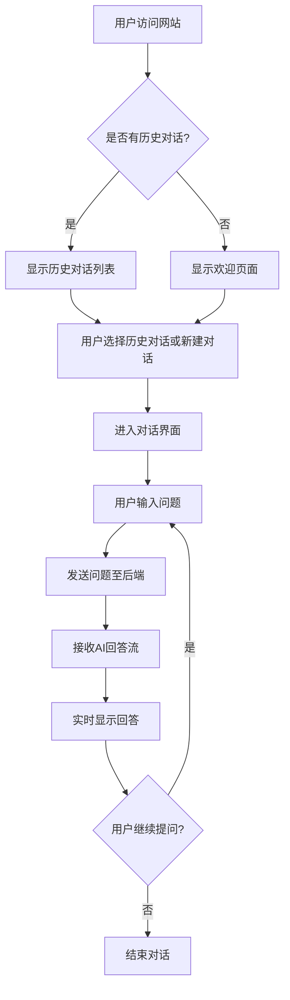
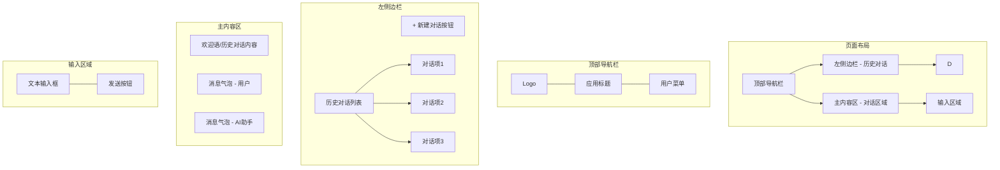

# UI/UX设计文档

## 1. 用户体验(UX)设计

### 1.1 信息架构

#### 主要功能模块
1. **对话交互模块**
   - 实时问答界面
   - 对话历史记录
2. **对话管理模块**
   - 新建对话
   - 历史对话查看
   - 对话删除

### 1.2 用户操作流程

#### 核心交互流程

### 1.3 线框图(Wireframe)

#### 主界面线框图

## 2. 用户界面(UI)设计

### 2.1 视觉风格

#### 颜色方案
- **主色调**：深蓝色 (#1E3A8A) - 专业、可靠
- **辅助色**：浅蓝色 (#DBEAFE) - 背景、高亮
- **文字色**：深灰色 (#1F2937) - 主要文字
- **辅助文字色**：中灰色 (#6B7280) - 次要信息
- **成功色**：绿色 (#10B981) - 成功状态
- **警告色**：橙色 (#F59E0B) - 警告状态
- **错误色**：红色 (#EF4444) - 错误状态

#### 字体方案
- **主要字体**：'Inter', 'Roboto', 'Helvetica Neue', Arial, sans-serif
- **字号规范**：
  - 标题：24px
  - 子标题：18px
  - 正文：16px
  - 辅助文字：14px
  - 小字注释：12px

#### 图标风格
- 使用简洁的线性图标
- 统一的线宽：2px
- 尺寸：16px、20px、24px三种规格

### 2.2 组件设计

#### 对话气泡
- **用户消息气泡**：
  - 背景色：深蓝色 (#1E3A8A)
  - 文字色：白色 (#FFFFFF)
  - 圆角：16px 16px 4px 16px
  - 对齐：右侧

- **AI助手消息气泡**：
  - 背景色：浅蓝色 (#DBEAFE)
  - 文字色：深灰色 (#1F2937)
  - 圆角：16px 16px 16px 4px
  - 对齐：左侧

#### 按钮
- **主要按钮**：
  - 背景色：深蓝色 (#1E3A8A)
  - 文字色：白色 (#FFFFFF)
  - 悬停效果：背景色加深 (#1E3A8A) + 阴影
  - 圆角：6px

- **次要按钮**：
  - 背景色：透明
  - 边框色：深蓝色 (#1E3A8A)
  - 文字色：深蓝色 (#1E3A8A)
  - 悬停效果：背景色变浅 (#DBEAFE)

#### 输入框
- 高度：40px
- 边框：1px浅灰色 (#D1D5DB)
- 圆角：6px
- 焦点状态：边框变为深蓝色 (#1E3A8A)

## 3. 交互原型设计

### 3.1 页面交互说明

#### 对话界面交互
1. **新建对话**：
   - 点击左侧"+ 新建对话"按钮
   - 清空当前对话内容
   - 创建新的对话记录

2. **发送消息**：
   - 在输入框中输入问题
   - 点击发送按钮或按Enter键
   - 显示用户消息气泡
   - 显示AI助手"正在输入"状态
   - 流式显示AI助手回答

3. **历史对话切换**：
   - 点击左侧历史对话项
   - 加载对应对话内容
   - 更新页面标题

4. **自动滚动**：
   - 新消息出现时自动滚动到底部
   - 用户手动滚动时暂停自动滚动

### 3.2 状态反馈

#### 加载状态
- 显示旋转动画
- 文字提示："AI助手正在思考..."

#### 错误状态
- 显示错误图标
- 文字提示："抱歉，出现了错误，请重试"
- 提供重试按钮

#### 空状态
- 显示欢迎语
- 提供示例问题引导用户

## 4. 响应式设计

### 4.1 桌面端布局 (≥1024px)
- 左侧边栏固定宽度：280px
- 主内容区自适应剩余空间
- 输入区域固定在底部

### 4.2 平板端布局 (768px - 1023px)
- 左侧边栏可折叠
- 点击菜单按钮展开/收起侧边栏
- 主内容区全宽显示

### 4.3 移动端布局 (≤767px)
- 左侧边栏隐藏
- 通过汉堡菜单访问历史对话
- 简化顶部导航栏